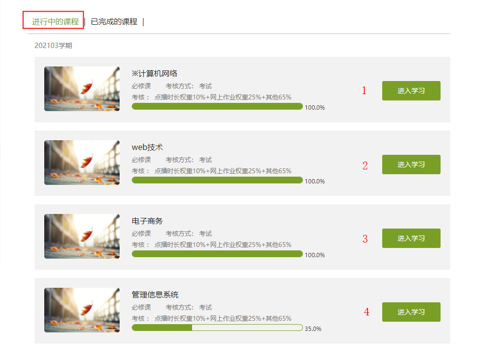

# auto-playing-online-lessons

This is a project that can help you automatically play annoying online lessons.

> 这是一个基于 Selenium + JavaScript 开发的一个用来模拟用户操作浏览器的项目。<br>
开发目的是用来挂网课，每次都要手动点下一个视频，非常麻烦 ┐(-｡ｰ;)┌ <br> 于是自己研究了一个播放完成自动点击下一个视频的程序。

***目前仅支持[四川大学成人继续教育学院](http://cce.scu.edu.cn/)***

### 功能

- [x] 自动登录并跳转到网课页。
- [x] 最大16倍速播放视频。
- [x] 播放完毕自动跳转下一章。
- [x] 自动跳过一些没有视频的页面。

### 依赖

[Selenium](https://www.selenium.dev/zh-cn/documentation/)<br>

使用Selenium需要安装浏览器驱动，详情请看[官方文档](https://www.selenium.dev/zh-cn/documentation/getting_started/installing_browser_drivers/)。

### 使用

1. 打开`src/config.js` 文件
2. 修改`config`配置
3. 运行项目

```shell
  userName: '', // 账号
  passWord: '', // 密码
  loginPage: '', // 登录页
  lesson : 1, // 第几课 - 从[进行中的课程]列表顺序来选择 入下图所示
  chapter: 1, // 第几章
  section: 1 // 第几节
  
  // ps：若想从课程目录2.4开始挂课。设置 chapter: 2, section: 4 则从第二章第四节开始挂课， 默认为第一课第一章第一小节开始挂课。
```



### 本地运行

1. 克隆项目

```shell
git clone https://github.com/zoudingyi/auto-playing-online-lessons.git

cd auto-playing-online-lessons
```

2. 安装依赖

```shell
npm install
```

3. 启动项目

```shell
npm run dev
```

**注意：** *在自动挂视频中，不要占用全屏。不知道什么原因，目前只要占用全屏，播放完当前视频切换到下一个视频后不会自动播放，当你切换到网课页又自动开始了。*
